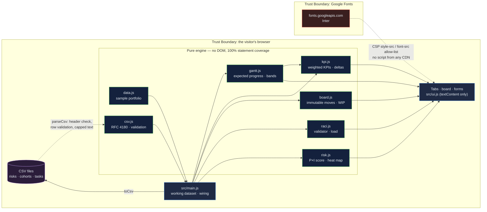

# EdTech Program Command Center: a programme console where every number is computed from the data beneath it

[](https://github.com/Freddricklogan/edtech-program-command-center/actions/workflows/deploy.yml)
[](#5-getting-started--verification)
[](https://github.com/Freddricklogan/edtech-program-command-center/actions/workflows/codeql.yml)
[](LICENSE)
[](https://freddricklogan.github.io/edtech-program-command-center/)

## 1. Executive Summary & Business Impact

**Problem statement.** Programme dashboards in education are usually slides:
a status colour someone chose, a percentage someone typed, a RACI chart
nobody checked against the one rule RACI has. They look like control and
provide none. When the numbers on the dashboard are not functions of the
work underneath it, the dashboard cannot be wrong — and so it cannot be
useful.

**Solution & value delivered.** A programme-management console for
educational delivery — roadmap, delivery board, cohort analytics, RACI and a
risk register — in which every figure on screen is computed from the dataset
on the same page. On-time delivery is the share of started phases within a
stated tolerance of where they should be today. Completion is weighted by
learners; satisfaction by survey responses. The board enforces work-in-progress
limits and says why a move was refused. The RACI validator lists every
workstream that breaks the rule. Risks carry probability and impact and are
scored, not labelled. Bring your own data as CSV; invalid rows are skipped
and named.

**[→ Read the full case study](docs/CASE_STUDY.md)**

| Outcome | How this repo delivers it |
| --- | --- |
| A dashboard that can be wrong, and therefore useful | Every KPI is a tested function of the roadmap, cohorts, budget and risk rows — the previous build typed "87% on time" as a literal; computed honestly, the same sample is at 33% |
| Governance artefacts that are checked, not drawn | `validateRaci()` requires exactly one Accountable and at least one Responsible per workstream; the sample chart fails on four rows and the console says which |
| Flow control a delivery lead recognises | WIP limits per column, refused moves with a reason, an explicit override, and a keyboard path for every move |
| Risk that is scored | Probability × impact on a 1–5 scale with explicit thresholds; a 5×5 heat map derived from the same numbers |
| Your data, not mine | CSV import for risks, cohorts and tasks with row-level validation and warnings; export back to CSV |

## 2. Demonstrated Competencies & Technical Skills

- **Systems Architecture & CS** — Six pure modules (`data`, `gantt`, `kpi`,
  `board`, `raci`, `risk`, `csv`) that never touch the DOM, a single render
  layer that never computes, and immutable board operations. That split is
  why 100% statement coverage of the logic is reachable and why the tour can
  drive the real functions.
- **Data Science & AI** — n/a. The analytics are weighted means and banded
  variances, deliberately transparent; no model is claimed.
- **Cybersecurity & Compliance** — `default-src 'none'` CSP with no inline
  script, style or handlers; an RFC 4180 CSV parser that validates every row
  of untrusted input and reports rather than throws; every user string rendered
  through `textContent`; CodeQL and Trivy in CI.
- **EdTech & Human-Centered Design** — Built for the programme-management
  work I do (career-readiness and cohort programmes): ARIA tabs with arrow
  keys, a keyboard path for drag-and-drop, labelled Gantt bars, a live status
  region, and a tour that breaks the rules on purpose so the reader sees the
  console react.

## 3. System Architecture & Data Flow



No script is loaded from any CDN; `connect-src 'none'`. Imported files never
leave the browser.

## 4. Technical Highlights & Engineering Decisions

### ADR-1 — Compute every KPI from the dataset, even when the answer is worse

**Context.** The previous build typed every headline as a string:
`"87%"`, `"+6 pts"`, `"2 high severity"`. The roadmap, cohorts and risks on
the same page were decoration.

**Decision.** `src/kpi.js` derives each card from the rows: on-time delivery
over *started* phases only (a phase that has not begun cannot be late),
completion weighted by learners, satisfaction weighted by responses. Deltas
compare against an explicit prior-period snapshot that the screen labels as
sample data.

**Consequence.** The sample portfolio now reports 33% on time and three of
four programmes off track, because that is what its roadmap says. A demo that
flatters its own data would have been easier to look at and would have
demonstrated nothing; a console's value is that it can deliver bad news.

### ADR-2 — Validate the RACI chart instead of drawing it

**Context.** RACI has one hard rule — exactly one Accountable per workstream —
and the sample chart broke it on three rows, with a fourth row lacking any
Responsible. Nothing noticed, because a chart is a picture.

**Decision.** `validateRaci()` returns errors per workstream and warnings for
concentration; the console lists them under the table and the shell's KPI
strip counts them. The sample data is left as it was, so the validator has
something to find, and a test pins all four findings.

**Consequence.** The chart is now a governance artefact rather than an
illustration, and a reviewer can see the difference in the first five
seconds of the tour.

### ADR-3 — Accept untrusted CSV and report rather than throw

**Context.** "Bring your own data" is the feature that makes a console real,
and CSV from a spreadsheet is never clean: ragged rows, quoted commas, a
probability of 9 on a 1–5 scale.

**Decision.** A small RFC 4180 parser (quotes, doubled quotes, embedded
newlines, CRLF, BOM) feeds per-collection importers that validate every row,
normalise and cap text, reject duplicate ids and unknown references, and
return warnings that name the row. A file with one bad line loads the others
and says which line it skipped.

**Consequence.** The import path has its own test file (11 tests including
full round-trips for all three collections), and the tour's last step imports
a file with a deliberately bad row so the behaviour is demonstrated rather
than described.

## 5. Getting Started & Verification

**Prerequisites.** Node 22 LTS (or any Node ≥ 20). No build step.

```bash
git clone https://github.com/Freddricklogan/edtech-program-command-center.git
cd edtech-program-command-center
npm install
npm run serve      # http://localhost:3000
```

**Verification — the numbers this repository actually produced:**

```bash
npm test         # Test Files 7 passed (7) · Tests 60 passed (60)
npm run coverage # All files 100% statements · 94.33% branches
npm run lint     # eslint . — clean
npm run validate # html-validate index.html — clean
```

| Check | Result |
| --- | --- |
| Unit tests | **60 passed / 60** across 7 files |
| Statement coverage (engine) | **100%** (branches 94.33%) |
| ESLint | clean |
| html-validate | clean (`no-inline-style` enforced) |
| Headless Chrome smoke | **0 console errors**; all five tour steps change state — WIP refusal message, four RACI findings listed, CSV import of 3 rows loads 2 and names the skipped row; keyboard "Move to" and WIP override verified; no horizontal scroll on any view at 400 px |

Coverage is measured over the pure modules. `src/main.js`, `src/ui.js` and
`src/exec-shell.js` are binding layers, excluded from the target and covered
by the browser smoke test instead. `AUDIT.md` lists every defect found in the
previous build with line numbers.

## 6. Live Demo & Production Showcase

**<https://freddricklogan.github.io/edtech-program-command-center/>**

No account, no credentials, no backend. All data is illustrative sample data
and the page says so.

**30-second guided walkthrough.** Press **Take the 30-second tour**; all five
steps perform the action they describe.

1. **Every number is computed** — resets to the sample and shows the KPI
   cards with their derivation in the caption.
2. **Plan versus reality** — the roadmap, with a marker on every bar for
   where the phase should be this month.
3. **WIP limits that refuse** — tries to pull a fourth card into In Progress;
   the limit of three refuses it and the status line says why.
4. **RACI that is checked** — the governance view, with the four violations in
   the sample chart listed under the table.
5. **Bring your own data** — imports a three-row risk CSV; two rows load, the
   third is skipped with a warning that names it.

Prefer to drive it yourself: drag cards or use each card's **Move to**
control; tick **Allow WIP overrides** to force a move; **Import risks /
cohorts / tasks** from CSV and **Export** them back; **Reset to sample** at
any time.

> **Deployment note.** Pages serves `index.html` from the repository root via
> `.github/workflows/deploy.yml`. **Settings → Pages → Source must be set to
> "GitHub Actions"** for the workflow to publish.
